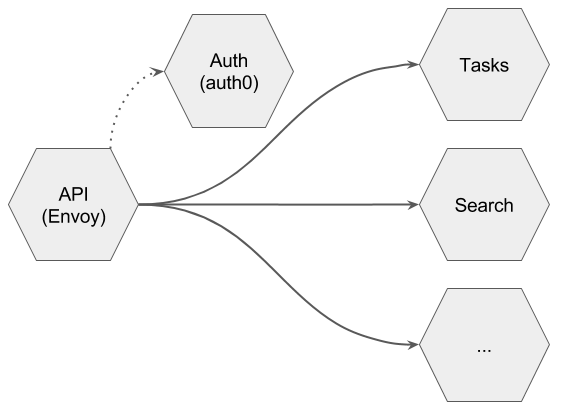

# Todo

Todo is an example application intended to illustrate the scaffolding
and developer tooling necessary to support effective development of a
microservices application.

This application uses kubernetes and envoy as foundational
technologies, as well as forge, telepresence, and ambassador to
provide a productive developer workflows on top of these tools.

If you are trying to bootstrap a microservices application, you can
use this as a starter kit and plug in your own services. If you
already have one, you can pick apart what you like from this and
ignore or adapt the rest.

The application consists of 6 services:

  - A tasks service (currently a simple facade around mongo) but
    notionally responsible for remembering whatever tasks a user might
    want to do.

  - A search service (currently a stub) but notionally responsible
    enabling users to find particular tasks on demand.

  - An API gateway service that uses envoy + ambassador to provide L7
    routing, traffic splitting (for canary releases), and
    authentication.

  - An authentication service that (via the ambassador plugin)
    provides custom authentication logic in a single edge service. The
    authentication service provides basic authentication with a
    hardcoded "todo" password, but can be easily modified to integrate
    with auth0.

  - A mongodb service deployed using stateful sets on top of
    kubernetes with backing store. This currently assumes google ssd
    storage, but can be easily modified for other cloud providers or
    custom kubernetes deployments.

  - A prometheus service deployed to collect metrics from kubernetes
    and the API gateway.

Service Topology:



This application provides a working example to illustrate all of the
following:

1. How to do authentication with microservices.

2. How to provide a fast dev/prototype experience (REPL) with
   microservices.

3. How to run tests with microservices.

4. How to quickly and easily deploy the entire application (or a
   subset of it) into different environments (shared dev, staging,
   prod, personal dev environments, isolated testing environments).

5. How to do canary deploys.

## Directory layout:

This application is layed out as a monorepo for convenience, however
each service directory is independently releasable, and all the
tooling provided will work seamlessly with a one repo per service
layout.

```
 <root>
   |
   |               API Gateway
   |
   +--- service.yaml        (service metadata for forge including
   |                         route config for the API gateway)
   |
   +--- Dockerfile          (dockerfile that builds the API Gateway)
   |
   +--- k8s/deployment.yaml (deployment templates for the API gateway)
   |
   |
   +--- auth                  Authentication Service
   |     |
   |     +--- service.yaml        (service metadata for forge)
   |     |
   |     +--- Dockerfile          (dockerfile that builds the authentication service)
   |     |
   |     +--- k8s/deployment.yaml (deployment templates for the auth service)
   |     |
   |     +--- app.py              (auth service implementation)
   |     
   |
   +--- tasks                 Tasks Service
   |     |
   |     +--- service.yaml        (service metadata for forge)
   |     |
   |     +--- Dockerfile          (dockerfile that builds the tasks service)
   |     |
   |     +--- k8s/deployment.yaml (deployment templates for the tasks service)
   |     |
   |     +--- *                   (task service implementation)
   |
   |
   +--- mongo                 MongoDB Service
   |     |
   |     +--- service.yaml        (service metadata for mongo)
   |     |
   |     +--- Dockerfile          (dockerfile that builds the mongo sidecar)
   |     |
   |     +--- k8s/deployment.yaml (deployment templates for mongo)
   |     |
   |     +--- *                   (see mongo/README.md for more details)
   |
   |
   +--- search                 Search Service
   |     |
   |     +--- service.yaml        (service metadata for forge)
   |     |
   |     +--- Dockerfile          (dockerfile that builds the search service)
   |     |
   |     +--- k8s/deployment.yaml (deployment templates for the search service)
   |     |
   |     +--- *                   (task service implementation)
   |
   |
   +--- prometheus             Search Service
   |     |
   |     +--- service.yaml        (service metadata for prometheus)
   |     |
   |     +--- Dockerfile          (dockerfile that builds prometheus container)
   |     |
   |     +--- k8s/deployment.yaml (deployment templates for prometheus)
   |     |
   |     +--- index.html          (skeletal console template for prometheus)
   |
   |
   +--- ...
   |
   .
   .
```

## Quick start

### Prerequisites

You will need the following installed locally:

* Python 2.7 or later
* Docker
* kubectl, configured to talk to the cluster where you want to deploy the application
* An account with a Docker Registry (e.g., Google Container Registry or Docker Hub)
* [Forge](http://forge.sh)

### Quick Start

1. Clone this repository: `git clone https://github.com/datawire/todo.git`

2. Change into cloned repo directory: `cd todo`

3. Run `forge setup`, which will configure Forge with your Docker Registry. If you've already done this, you can skip this step.

4. Run `forge deploy`. This will build Docker images for all the services of the application, push them into the Docker registry, and deploy them into Kubernetes.

5. Change to the tasks directory and do a canary deploy of tasks:
   `cd tasks && CANARY=true forge deploy`

6. Run `curl <api>/tasks -u any:todo` and `curl <api>/search -u any:todo` to see things
   work.

Note, step 5 is a bit of a wart/edge case and should be able to go
away at some point.

The reason step 5 is necessary is because the tasks service always has
two deployments, the stable deployment, and the canary deployment. The
API gateway is configured to split traffic between these two
deployments in a 90%/10% proportion. If you have nothing to canary,
you simply deploy the stable code into the canary deployment and the
traffic still flows to both deployments, but each deployment is
running the same code.

This is simple to set up, and can be easily customized (even
dynamically) to split a different proportion of traffic depending on
what is appropriate for a given microservice, however this does
currently leave the bootstrapping wart of doing a 'noop' canary deploy
in order to avoid 10% of your traffic flowing to a nonexistent
deployment.

### Deploying a change

1. Edit any files you would like to change.

2. Run: `forge deploy`

This will redeploy any pieces necessary. Note that `forge deploy` will
figure out what services to operate on based on the current working
directory. If you want to deploy a change to just one service
(e.g. just the tasks service), cd into `tasks` and run `forge deploy`
from there.

### Deploying a canary

Note that only the tasks service is set up to enable canary
deployments. One of the benefits of independently releasable services,
is that you can use different workflows for different services, rapid
application development for new services with no users, and careful
canary releases for stable services with many users.

1. Change to the tasks directory: `cd tasks`

2. Change whatever you would like (code, deployment metadata, etc).

3. Run: `CANARY=true forge deploy`

4. Run `curl <api>/tasks/` in a shell script loop, e.g.,

   `while true; do curl http://${GATEWAY_URL}/tasks; done`

This will push your change to the canary deployment for tasks, and now
10% of the traffic to the tasks service will hit your canary. Envoy uses a windowing algorithm to load balance traffic, so you will want to use the loop instead of running curl requests by hand.

## Rapid application development

This requires installing [telepresence](telepresence.io). Please note
that telepresence will temporarily replace the deployment it is
operating on and direct incoming traffic to your laptop. This is great
if you want to develop the service in your own environment, but *not*
recommended if your service is taking production traffic!

1. Change to the service you would like to develop: `cd search`

2. Edit app.py and add debug=True to enable file watch/reload.

3. Run: `telepresence --expose 8080 -s search` (this will start a shell)

4. From within the telepresence shell, run: `python app.py`

5. Hack away while running `curl <api>/search` and see your changes
   live reload.

## Authentication

The API gateway is configured to use the
[ambassador](getambassador.io) plugin to provide custom edge
authentication. The way this works is that envoy (with the ambassador
plugin) will first route every connection to the auth service. If this
service returns a 200, then envoy will continue to route that
connection the way it normally would. If the auth service returns
anything other than a 200, then this result is returned directly to
the originator of the connection.

You can put whatever logic you want to in the the auth service and
implement/reimplement the auth service in whatever language you wish.

Currently the auth service provides authentication via an auth0
integration as well as using a hard coded basic authentication check
with a password of "todo".

If you would like to use this implementation as a model for your own
auth0 integration, you should change the constants defined in
`auth/service.yaml` to reference your own auth0 account. You should
also disable (or change) the basic authentication check.

## Rationale

Microservices is not a technology, design, or architecture. It is
first and foremost a new way of building software.

This way of working has two main benefits. First it is particularly
well suited to improving continuous uptime systems *while* they are in
use.

Second, it is particularly well suited to dividing up the work of
building these systems amongst many autonomous fast-moving teams.

The technology that exists in this space did not enable this new way
of working, rather the reverse. A new way of working resulted in a
bunch of tools that help make it more efficient, but are not
ultimately necessary.

Most of the technology that has been open sourced, does not actually
illustrate the workflow (how it is used, and when it is appropriate to
use). This application is intended to fill that gap by illustrating
how you can leverage the foundational technology open sourced by
successful microservices companies to provide the development
workflows that are key to realizing the benefits of microservices.
